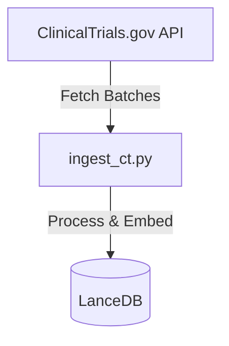
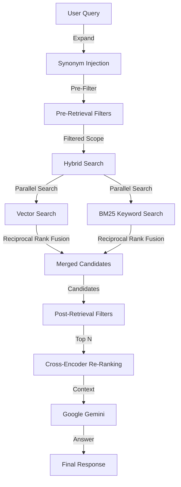
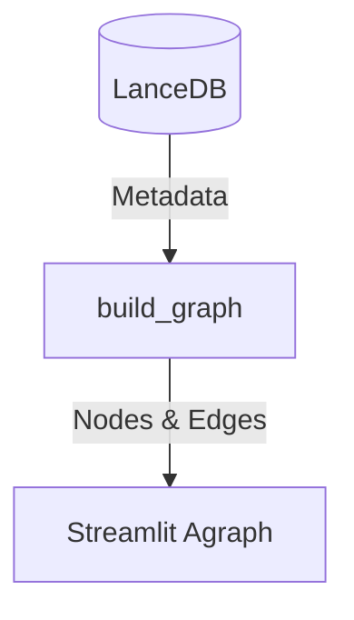

# Clinical Trial Inspector Agent 🕵️‍♂️💊

**Clinical Trial Inspector** is an advanced AI agent designed to revolutionize how researchers, clinicians, and analysts explore clinical trial data. By combining **Semantic Search**, **Retrieval-Augmented Generation (RAG)**, and **Visual Analytics**, it transforms raw data from [ClinicalTrials.gov](https://clinicaltrials.gov/) into actionable insights.

Built with **LangChain**, **LlamaIndex**, **Streamlit**, **Altair**, **Streamlit-Agraph**, and **Google Gemini**, this tool goes beyond simple keyword search. It understands natural language, generates inline visualizations, performs complex multi-dimensional analysis, and visualizes relationships in an interactive knowledge graph.

## ✨ Key Features

### 2. 🧠 Intelligent Search & Retrieval
*   **Hybrid Search**: Combines **Semantic Search** (vector similarity) with **BM25 Keyword Search** (sparse retrieval) using **LanceDB's Native Hybrid Search**. This ensures you find studies that match both the *meaning* (e.g., "kidney cancer" -> "renal cell carcinoma") and *exact terms* (e.g., "NCT04589845", "Teclistamab").
*   **Smart Filtering**:
    *   **Strict Pre-Filtering**: For specific sponsors (e.g., "Pfizer"), it forces the engine to look *only* at that sponsor's studies first, ensuring 100% recall.
    *   **Strict Keyword Filtering (Analytics Only)**: For counting questions (e.g., "How many studies..."), the **Analytics Engine** (`get_study_analytics`) prioritizes studies where the query explicitly appears in the **Title** or **Conditions**, ensuring high precision and accurate counts.
    *   **Sponsor Alias Support**: Intelligently maps aliases (e.g., "J&J", "MSD") to their canonical sponsor names ("Janssen", "Merck Sharp & Dohme") for accurate aggregation.
*   **Smart Summary**: Returns a clean, concise list of relevant studies.
*   **Query Expansion**: Automatically expands your search terms with medical synonyms (e.g., "Heart Attack" -> "Myocardial Infarction").
*   **Re-Ranking**: Uses a Cross-Encoder (`ms-marco-MiniLM`) to re-score results for maximum relevance.
*   **Query Decomposition**: Breaks down complex multi-part questions (e.g., *"Compare the primary outcomes of Keytruda vs Opdivo"*) into sub-questions for precise answers.
*   **Cohort SQL Generation**: Translates eligibility criteria into standard SQL queries (OMOP CDM) for patient cohort identification.

### 📊 Visual Analytics & Insights
- **Inline Charts (Contextual)**: The agent automatically generates **Bar Charts** and **Line Charts** directly in the chat stream when you ask aggregation questions (e.g., *"Top sponsors for Multiple Myeloma"*).
- **Analytics Dashboard (Global)**: A dedicated dashboard to analyze trends across the **entire dataset** (60,000+ studies), independent of your chat session.
- **Interactive Knowledge Graph**: Visualize connections between **Studies**, **Sponsors**, and **Conditions** in a dynamic, interactive network graph.

### 🌍 Geospatial Dashboard
- **Global Trial Map**: Visualize the geographic distribution of clinical trials on an interactive world map.
- **Region Toggle**: Switch between **World View** (Country-level aggregation) and **USA View** (State-level aggregation).
- **Dot Visualization**: Uses dynamic **CircleMarkers** (dots) sized by trial count to show density.
- **Interactive Filters**: Filter the map by **Phase**, **Status**, **Sponsor**, **Start Year**, and **Study Type**.

### 🔍 Multi-Filter Analysis
- **Complex Filtering**: Answer sophisticated questions by applying multiple filters simultaneously.
    - *Example*: *"For **Phase 2 and 3** studies, what are **Pfizer's** most common study indications?"*
- **Full Dataset Scope**: General analytics questions analyze the **entire database**, not just a sample.
- **Smart Retrieval**: Retrieves up to **5,000 relevant studies** for comprehensive analysis.

### ⚡ High-Performance Ingestion
- **Parallel Processing**: Uses multi-core processing to ingest and embed thousands of studies per minute.
- **LanceDB Integration**: Uses **LanceDB** for high-performance vector storage and native hybrid search.
- **Idempotent Updates**: Smartly updates existing records without duplication, allowing for seamless data refreshes.

## 🤖 Agent Capabilities & Tools

The agent is equipped with specialized tools to handle different types of requests:

### 1. `search_trials`
*   **Purpose**: Finds specific clinical trials based on natural language queries.
*   **Capabilities**: Semantic Search, Smart Filtering (Phase, Status, Sponsor, Intervention), Query Expansion, Hybrid Search, Re-Ranking.

### 2. `get_study_analytics`
*   **Purpose**: Aggregates data to reveal trends and insights.
*   **Capabilities**: Multi-Filtering, Grouping (Phase, Status, Sponsor, Year, Condition), Full Dataset Access, Inline Visualization.

### 3. `compare_studies`
*   **Purpose**: Handles complex comparison or multi-part questions.
*   **Capabilities**: Uses **Query Decomposition** to break a complex query into sub-queries, executes them against the database, and synthesizes the results.

### 4. `find_similar_studies`
*   **Purpose**: Discovers studies that are semantically similar to a specific trial.
*   **Capabilities**: 
    *   **NCT Lookup**: Automatically fetches content if queried with an NCT ID.
    *   **Self-Exclusion**: Filters out the reference study from results.
    *   **Scoring**: Returns similarity scores for transparency.

### 5. `get_study_details`
*   **Purpose**: Fetches the full text content of a specific study by NCT ID.
*   **Capabilities**: Retrieves all chunks of a study to provide comprehensive details (Criteria, Summary, Protocol).

### 6. `get_cohort_sql`
*   **Purpose**: Translates clinical trial eligibility criteria into standard SQL queries for claims data analysis.
*   **Capabilities**:
    *   **Extraction**: Parses text into structured inclusion/exclusion rules (Concepts, Codes).
    *   **SQL Generation**: Generates OMOP-compatible SQL queries targeting `medical_claims` and `pharmacy_claims`.
    *   **Logic Enforcement**: Applies temporal logic (e.g., "2 diagnoses > 30 days apart") for chronic conditions.

## ⚙️ How It Works (RAG Pipeline)

1.  **Ingestion**: `ingest_ct.py` fetches study data from ClinicalTrials.gov. It extracts rich text (including **Eligibility Criteria** and **Interventions**) and structured metadata. It uses **multiprocessing** for speed.
2.  **Embedding**: Text is converted into vector embeddings using `PubMedBERT` and stored in **LanceDB**.
3.  **Retrieval**:
    *   **Query Transformation**: Synonyms are injected via LLM.
    *   **Pre-Filtering**: Strict filters (Status, Year, Sponsor) reduce the search scope.
    *   **Hybrid Search**: Parallel **Vector Search** (Semantic) and **BM25** (Keyword) combined via **LanceDB Native Hybrid Search**.
    *   **Post-Filtering**: Additional metadata checks (Phase, Intervention) on retrieved candidates.
    *   **Re-Ranking**: Cross-Encoder re-scoring.
4.  **Synthesis**: **Google Gemini** synthesizes the final answer.

### 🏗️ Ingestion Pipeline



### 🧠 RAG Retrieval Flow



### 🕸️ Knowledge Graph



## 🛠️ Tech Stack

- **Frontend**: Streamlit, Altair, Streamlit-Agraph
- **LLM**: Google Gemini (`gemini-2.5-flash`)
- **Orchestration**: LangChain (Agents, Tool Calling)
- **Retrieval (RAG)**: LlamaIndex (VectorStoreIndex, SubQuestionQueryEngine)
- **Vector Database**: LanceDB (Local)
- **Embeddings**: HuggingFace (`pritamdeka/S-PubMedBert-MS-MARCO`)

## 🚀 Getting Started

### Prerequisites

- Python 3.10+
- A Google Cloud API Key with access to Gemini

### Installation

1. **Clone the repository**
   ```bash
   git clone <repository-url>
   cd clinical_trial_agent
   ```

2. **Create and activate a virtual environment**
   ```bash
   python -m venv venv
   source venv/bin/activate  # On Windows: venv\Scripts\activate
   ```

3. **Install dependencies**
   ```bash
   pip install -r requirements.txt
   ```

4. **Set up Environment Variables**
   Create a `.env` file in the root directory and add your Google API Key:
   ```bash
   GOOGLE_API_KEY=your_google_api_key_here
   ```

## 📖 Usage

### 1. Ingest Data
Populate the local database. The script uses parallel processing for speed.

```bash
# Recommended: Ingest 5000 recent studies
python scripts/ingest_ct.py --limit 5000 --years 5

# Ingest ALL studies (Warning: Large download!)
python scripts/ingest_ct.py --limit -1 --years 10
```

### 2. Run the Agent
Launch the Streamlit application:

```bash
streamlit run ct_agent_app.py
```

### 3. Ask Questions!
- **Search**: *"Find studies for Multiple Myeloma."*
- **Comparison**: *"Compare the primary outcomes of Keytruda vs Opdivo."*
- **Analytics**: *"Who are the top sponsors for Breast Cancer?"* (Now supports grouping by **Intervention** and **Study Type**!)
- **Graph**: Go to the **Knowledge Graph** tab to visualize connections.

## 🧪 Testing & Quality

- **Unit Tests**: Run `python -m pytest tests/test_unit.py` to verify core logic.
- **Hybrid Search Tests**: Run `python -m pytest tests/test_hybrid_search.py` to verify the search engine's precision and recall.
- **Data Integrity**: Run `python -m unittest tests/test_data_integrity.py` to verify database content against known ground truths.
- **Sponsor Normalization**: Run `python -m pytest tests/test_sponsor_normalization.py` to verify alias mapping logic.
- **Linting**: Codebase is formatted with `black` and linted with `flake8`.

## 📂 Project Structure

- `ct_agent_app.py`: Main application logic.
- `modules/`:
    - `utils.py`: Configuration, Normalization, Custom Filters.
    - `constants.py`: Static data (Coordinates, Mappings).
    - `tools.py`: Tool definitions (`search_trials`, `compare_studies`, etc.).
    - `cohort_tools.py`: SQL generation logic (`get_cohort_sql`).
    - `graph_viz.py`: Knowledge Graph logic.
- `scripts/`:
    - `ingest_ct.py`: Parallel data ingestion pipeline.
    - `analyze_db.py`: Database inspection.

- `ct_gov_lancedb/`: Persisted LanceDB vector store.
- `tests/`:
    - `test_unit.py`: Core logic tests.
    - `test_hybrid_search.py`: Integration tests for search engine.

## 🐳 Deployment

The application is container-ready and can be deployed using Docker.

### Build the Image
```bash
docker build -t clinical-trial-agent .
```

### Run the Container
You can run the container in two modes:

**1. Admin Mode (API Key in Environment)**
Pass the key as an environment variable. Users will not be prompted.
```bash
docker run -p 8501:8501 -e GOOGLE_API_KEY=your_key_here clinical-trial-agent
```

**2. User Mode (Prompt for Key)**
Run without the key. Users will be prompted to enter their own key in the sidebar.
```bash
docker run -p 8501:8501 clinical-trial-agent
```

### Hosting Options
- **Hugging Face Spaces**: Select "Docker" SDK. Add `GOOGLE_API_KEY` to Secrets for Admin Mode.
- **Google Cloud Run**: Deploy the container and map port 8501.

